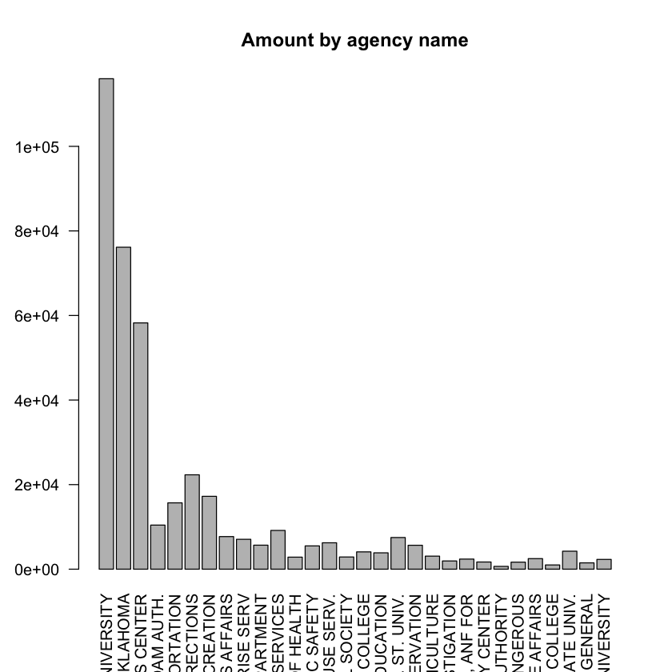

### Oklahoma purchase credit card transactions

The Office of Management and Enterprise Services in the State of Oklahoma has made its [purchase credit card transactions](https://catalog.data.gov/dataset/purchase-card-pcard-fiscal-year-2014) available. This dataset contains information on purchases made through the purchase card programs administered by the state and higher education institutions. 

In this assignment, you will complete the following tasks.

- Create new features and conduct exploratory data analysis. Your exploratory data analysis should be as exhaustive as possible. 
- Each feature or discussion is a new lead. Structure your EDA for different leads with sub-sections. Each sub-section will cover the following:
    - Lead: Write what you are going to do in two to three sentences.
    - Analysis: your EDA
    - Conclusion: What is the business insight? How can this feature help prediction? Write a short conclusion in the end of each sub-section. 

-  Submit in the HTML format.  


```R
library(dplyr)
#library(DataExplorer)
#library(xda)
library(ggplot2)
library(plotly)
```

    
    Attaching package: ‘dplyr’
    
    The following objects are masked from ‘package:stats’:
    
        filter, lag
    
    The following objects are masked from ‘package:base’:
    
        intersect, setdiff, setequal, union
    
    
    Attaching package: ‘plotly’
    
    The following object is masked from ‘package:ggplot2’:
    
        last_plot
    
    The following object is masked from ‘package:stats’:
    
        filter
    
    The following object is masked from ‘package:graphics’:
    
        layout
    


```R
ccard <- read.csv("/Users/chriskuo/Downloads/purchase_credit_card.csv")
```


```R
dim(ccard)
summary(ccard)
colnames(ccard)
```


<ol class=list-inline>
	<li>442458</li>
	<li>11</li>
</ol>


       Year.Month     Agency.Number  
     Min.   :201307   Min.   : 1000  
     1st Qu.:201309   1st Qu.: 1000  
     Median :201401   Median :47700  
     Mean   :201357   Mean   :42786  
     3rd Qu.:201404   3rd Qu.:76000  
     Max.   :201406   Max.   :98000  
                                     
                                    Agency.Name    
     OKLAHOMA STATE UNIVERSITY            :115995  
     UNIVERSITY OF OKLAHOMA               : 76143  
     UNIV. OF OKLA. HEALTH SCIENCES CENTER: 58247  
     DEPARTMENT OF CORRECTIONS            : 22322  
     DEPARTMENT OF TOURISM AND RECREATION : 17232  
     DEPARTMENT OF TRANSPORTATION         : 15689  
     (Other)                              :136830  
                   Cardholder.Last.Name Cardholder.First.Initial
     JOURNEY HOUSE TRAVEL INC: 10137    J      : 55031          
     UNIVERSITY AMERICAN     :  7219    G      : 42251          
     JOURNEY HOUSE TRAVEL    :  4693    D      : 38120          
     Heusel                  :  4212    M      : 35352          
     Hines                   :  3423    S      : 34698          
     Bowers                  :  2448    C      : 33213          
     (Other)                 :410326    (Other):203793          
                            Description         Amount         
     GENERAL PURCHASE             :247187   Min.   : -42863.0  
     AIR TRAVEL                   : 29584   1st Qu.:     30.9  
     ROOM CHARGES                 : 18120   Median :    104.9  
     AT&T SERVICE PAYMENT ITM     :  2657   Mean   :    425.0  
     001 Priority          1LB PCE:  2005   3rd Qu.:    345.0  
     000000000000000000000000     :  1828   Max.   :1903858.4  
     (Other)                      :141077                      
                           Vendor                     Transaction.Date 
     STAPLES                  : 14842   09/11/2013 12:00:00 AM:  2122  
     AMAZON MKTPLACE PMTS     : 12197   08/07/2013 12:00:00 AM:  2108  
     WW GRAINGER              : 12076   01/14/2014 12:00:00 AM:  2059  
     Amazon.com               : 10766   01/16/2014 12:00:00 AM:  2009  
     BILL WARREN OFFICE PRODUC:  4479   09/05/2013 12:00:00 AM:  1999  
     LOWES #00241             :  4231   10/01/2013 12:00:00 AM:  1996  
     (Other)                  :383867   (Other)               :430165  
                     Posted.Date    
     01/13/2014 12:00:00 AM:  3256  
     04/14/2014 12:00:00 AM:  3163  
     03/10/2014 12:00:00 AM:  3139  
     03/03/2014 12:00:00 AM:  3101  
     09/16/2013 12:00:00 AM:  3062  
     01/20/2014 12:00:00 AM:  3032  
     (Other)               :423705  
                                              Merchant.Category.Code..MCC.
     STATIONERY, OFFICE SUPPLIES, PRINTING AND WRITING PAPER: 24860       
     BOOK STORES                                            : 21981       
     INDUSTRIAL SUPPLIES NOT ELSEWHERE CLASSIFIED           : 21669       
     DENTAL/LABORATORY/MEDICAL/OPHTHALMIC HOSP EQIP AND SUP.: 20183       
     GROCERY STORES,AND SUPERMARKETS                        : 17152       
     MISCELLANEOUS AND SPECIALTY RETAIL STORES              : 13335       
     (Other)                                                :323278       


<ol class=list-inline>
	<li>'Year.Month'</li>
	<li>'Agency.Number'</li>
	<li>'Agency.Name'</li>
	<li>'Cardholder.Last.Name'</li>
	<li>'Cardholder.First.Initial'</li>
	<li>'Description'</li>
	<li>'Amount'</li>
	<li>'Vendor'</li>
	<li>'Transaction.Date'</li>
	<li>'Posted.Date'</li>
	<li>'Merchant.Category.Code..MCC.'</li>
</ol>


```R
# Count of agencies
# Spent by agency
# Count by merchant.Category.Code
colnames(ccard)<-c('Year_Month', 'Agency_Number', 'Agency_Name', 'Cardholder_Last_Name',
      'Cardholder_First_Initial', 'Description', 'Amount', 'Vendor', 'Transaction_Date',
      'Posted_Date', 'Merchant_Category')
```


```R
nrow(ccard)
```


442458


```R
# Simple Bar Plot 
stat_by_agency <- ccard %>% group_by(Agency_Name) %>%
    summarise(count = n(),
              amount = sum(Amount),
              mean = mean(Amount),
              min = min(Amount),
              max = max(Amount)
             ) %>%
    arrange(desc(amount)) %>% ungroup() 

stat_by_agency <- stat_by_agency %>%
    mutate(row = rep(1:nrow(stat_by_agency)),
          Agency_Name_ind = paste(row,Agency_Name,sep="_"),
          percent = amount/sum(amount)) %>%
    select(Agency_Name_ind,count, amount, percent,mean, min, max)

head(stat_by_agency)
temp <-stat_by_agency[1:30,]
barplot(temp$count,names.arg=temp$Agency_Name_ind,
main="Amount by agency name",las=2       )
```


<table>
<thead><tr><th scope=col>Agency_Name_ind</th><th scope=col>count</th><th scope=col>amount</th><th scope=col>percent</th><th scope=col>mean</th><th scope=col>min</th><th scope=col>max</th></tr></thead>
<tbody>
	<tr><td>1_OKLAHOMA STATE UNIVERSITY            </td><td>115995                                 </td><td>33778840                               </td><td>0.17963575                             </td><td> 291.2094                              </td><td> -6266.53                              </td><td>  27967.38                             </td></tr>
	<tr><td>2_UNIVERSITY OF OKLAHOMA               </td><td> 76143                                 </td><td>24886383                               </td><td>0.13234570                             </td><td> 326.8374                              </td><td>-41740.00                              </td><td> 114203.17                             </td></tr>
	<tr><td>3_UNIV. OF OKLA. HEALTH SCIENCES CENTER</td><td> 58247                                 </td><td>24527325                               </td><td>0.13043623                             </td><td> 421.0916                              </td><td> -7188.61                              </td><td>1903858.37                             </td></tr>
	<tr><td>4_GRAND RIVER DAM AUTH.                </td><td> 10427                                 </td><td>22213829                               </td><td>0.11813306                             </td><td>2130.4142                              </td><td> -9000.00                              </td><td>1089180.00                             </td></tr>
	<tr><td>5_DEPARTMENT OF TRANSPORTATION         </td><td> 15689                                 </td><td>14399262                               </td><td>0.07657522                             </td><td> 917.7935                              </td><td>-34108.00                              </td><td> 348053.75                             </td></tr>
	<tr><td>6_DEPARTMENT OF CORRECTIONS            </td><td> 22322                                 </td><td>13988872                               </td><td>0.07439277                             </td><td> 626.6854                              </td><td>-20000.00                              </td><td>  96190.38                             </td></tr>
</tbody>
</table>





#### Create timestamp


```R
time_by_agency <- ccard %>% group_by(Agency_Name) %>%
    mutate(Transaction_Date=as.Date(Transaction_Date,format="%m/%d/%Y %H:%M")) %>%
    arrange(Agency_Name,Transaction_Date) %>%
    mutate(time = Transaction_Date-lag(Transaction_Date) ) 
    
time_by_agency[,c("Agency_Number","Agency_Name", "Transaction_Date", "time")]
```


<table>
<thead><tr><th scope=col>Agency_Number</th><th scope=col>Agency_Name</th><th scope=col>Transaction_Date</th><th scope=col>time</th></tr></thead>
<tbody>
	<tr><td>26500                   </td><td>`DEPARTMENT OF EDUCATION</td><td>2013-06-29              </td><td>NA days                 </td></tr>
	<tr><td>26500                   </td><td>`DEPARTMENT OF EDUCATION</td><td>2013-07-01              </td><td> 2 days                 </td></tr>
	<tr><td>26500                   </td><td>`DEPARTMENT OF EDUCATION</td><td>2013-07-01              </td><td> 0 days                 </td></tr>
	<tr><td>26500                   </td><td>`DEPARTMENT OF EDUCATION</td><td>2013-07-03              </td><td> 2 days                 </td></tr>
	<tr><td>26500                   </td><td>`DEPARTMENT OF EDUCATION</td><td>2013-07-03              </td><td> 0 days                 </td></tr>
	<tr><td>26500                   </td><td>`DEPARTMENT OF EDUCATION</td><td>2013-07-03              </td><td> 0 days                 </td></tr>
	<tr><td>26500                   </td><td>`DEPARTMENT OF EDUCATION</td><td>2013-07-03              </td><td> 0 days                 </td></tr>
	<tr><td>26500                   </td><td>`DEPARTMENT OF EDUCATION</td><td>2013-07-03              </td><td> 0 days                 </td></tr>
	<tr><td>26500                   </td><td>`DEPARTMENT OF EDUCATION</td><td>2013-07-03              </td><td> 0 days                 </td></tr>
	<tr><td>26500                   </td><td>`DEPARTMENT OF EDUCATION</td><td>2013-07-03              </td><td> 0 days                 </td></tr>
	<tr><td>26500                   </td><td>`DEPARTMENT OF EDUCATION</td><td>2013-07-03              </td><td> 0 days                 </td></tr>
	<tr><td>26500                   </td><td>`DEPARTMENT OF EDUCATION</td><td>2013-07-03              </td><td> 0 days                 </td></tr>
	<tr><td>26500                   </td><td>`DEPARTMENT OF EDUCATION</td><td>2013-07-03              </td><td> 0 days                 </td></tr>
	<tr><td>26500                   </td><td>`DEPARTMENT OF EDUCATION</td><td>2013-07-03              </td><td> 0 days                 </td></tr>
	<tr><td>26500                   </td><td>`DEPARTMENT OF EDUCATION</td><td>2013-07-03              </td><td> 0 days                 </td></tr>
	<tr><td>26500                   </td><td>`DEPARTMENT OF EDUCATION</td><td>2013-07-05              </td><td> 2 days                 </td></tr>
	<tr><td>26500                   </td><td>`DEPARTMENT OF EDUCATION</td><td>2013-07-05              </td><td> 0 days                 </td></tr>
	<tr><td>26500                   </td><td>`DEPARTMENT OF EDUCATION</td><td>2013-07-08              </td><td> 3 days                 </td></tr>
	<tr><td>26500                   </td><td>`DEPARTMENT OF EDUCATION</td><td>2013-07-08              </td><td> 0 days                 </td></tr>
	<tr><td>26500                   </td><td>`DEPARTMENT OF EDUCATION</td><td>2013-07-08              </td><td> 0 days                 </td></tr>
	<tr><td>26500                   </td><td>`DEPARTMENT OF EDUCATION</td><td>2013-07-08              </td><td> 0 days                 </td></tr>
	<tr><td>26500                   </td><td>`DEPARTMENT OF EDUCATION</td><td>2013-07-08              </td><td> 0 days                 </td></tr>
	<tr><td>26500                   </td><td>`DEPARTMENT OF EDUCATION</td><td>2013-07-08              </td><td> 0 days                 </td></tr>
	<tr><td>26500                   </td><td>`DEPARTMENT OF EDUCATION</td><td>2013-07-08              </td><td> 0 days                 </td></tr>
	<tr><td>26500                   </td><td>`DEPARTMENT OF EDUCATION</td><td>2013-07-08              </td><td> 0 days                 </td></tr>
	<tr><td>26500                   </td><td>`DEPARTMENT OF EDUCATION</td><td>2013-07-09              </td><td> 1 days                 </td></tr>
	<tr><td>26500                   </td><td>`DEPARTMENT OF EDUCATION</td><td>2013-07-09              </td><td> 0 days                 </td></tr>
	<tr><td>26500                   </td><td>`DEPARTMENT OF EDUCATION</td><td>2013-07-09              </td><td> 0 days                 </td></tr>
	<tr><td>26500                   </td><td>`DEPARTMENT OF EDUCATION</td><td>2013-07-09              </td><td> 0 days                 </td></tr>
	<tr><td>26500                   </td><td>`DEPARTMENT OF EDUCATION</td><td>2013-07-09              </td><td> 0 days                 </td></tr>
	<tr><td>⋮</td><td>⋮</td><td>⋮</td><td>⋮</td></tr>
	<tr><td>88000                          </td><td>WILL ROGERS MEMORIAL COMMISSION</td><td>2014-03-11                     </td><td> 4 days                        </td></tr>
	<tr><td>88000                          </td><td>WILL ROGERS MEMORIAL COMMISSION</td><td>2014-03-11                     </td><td> 0 days                        </td></tr>
	<tr><td>88000                          </td><td>WILL ROGERS MEMORIAL COMMISSION</td><td>2014-03-19                     </td><td> 8 days                        </td></tr>
	<tr><td>88000                          </td><td>WILL ROGERS MEMORIAL COMMISSION</td><td>2014-03-21                     </td><td> 2 days                        </td></tr>
	<tr><td>88000                          </td><td>WILL ROGERS MEMORIAL COMMISSION</td><td>2014-03-24                     </td><td> 3 days                        </td></tr>
	<tr><td>88000                          </td><td>WILL ROGERS MEMORIAL COMMISSION</td><td>2014-04-09                     </td><td>16 days                        </td></tr>
	<tr><td>88000                          </td><td>WILL ROGERS MEMORIAL COMMISSION</td><td>2014-04-22                     </td><td>13 days                        </td></tr>
	<tr><td>88000                          </td><td>WILL ROGERS MEMORIAL COMMISSION</td><td>2014-04-24                     </td><td> 2 days                        </td></tr>
	<tr><td>88000                          </td><td>WILL ROGERS MEMORIAL COMMISSION</td><td>2014-04-25                     </td><td> 1 days                        </td></tr>
	<tr><td>88000                          </td><td>WILL ROGERS MEMORIAL COMMISSION</td><td>2014-04-25                     </td><td> 0 days                        </td></tr>
	<tr><td>88000                          </td><td>WILL ROGERS MEMORIAL COMMISSION</td><td>2014-05-01                     </td><td> 6 days                        </td></tr>
	<tr><td>88000                          </td><td>WILL ROGERS MEMORIAL COMMISSION</td><td>2014-05-06                     </td><td> 5 days                        </td></tr>
	<tr><td>88000                          </td><td>WILL ROGERS MEMORIAL COMMISSION</td><td>2014-05-14                     </td><td> 8 days                        </td></tr>
	<tr><td>88000                          </td><td>WILL ROGERS MEMORIAL COMMISSION</td><td>2014-05-15                     </td><td> 1 days                        </td></tr>
	<tr><td>88000                          </td><td>WILL ROGERS MEMORIAL COMMISSION</td><td>2014-05-24                     </td><td> 9 days                        </td></tr>
	<tr><td>88000                          </td><td>WILL ROGERS MEMORIAL COMMISSION</td><td>2014-05-30                     </td><td> 6 days                        </td></tr>
	<tr><td>88000                          </td><td>WILL ROGERS MEMORIAL COMMISSION</td><td>2014-06-24                     </td><td>25 days                        </td></tr>
	<tr><td>88000                          </td><td>WILL ROGERS MEMORIAL COMMISSION</td><td>2014-06-28                     </td><td> 4 days                        </td></tr>
	<tr><td>86500                          </td><td>WORKER'S COMP. COMMISSION      </td><td>2014-03-12                     </td><td>NA days                        </td></tr>
	<tr><td>36900                          </td><td>WORKERS COMPENSATION COURT     </td><td>2013-07-24                     </td><td>NA days                        </td></tr>
	<tr><td>36900                          </td><td>WORKERS COMPENSATION COURT     </td><td>2013-07-24                     </td><td> 0 days                        </td></tr>
	<tr><td>36900                          </td><td>WORKERS COMPENSATION COURT     </td><td>2013-08-02                     </td><td> 9 days                        </td></tr>
	<tr><td>36900                          </td><td>WORKERS COMPENSATION COURT     </td><td>2013-08-16                     </td><td>14 days                        </td></tr>
	<tr><td>36900                          </td><td>WORKERS COMPENSATION COURT     </td><td>2013-08-27                     </td><td>11 days                        </td></tr>
	<tr><td>36900                          </td><td>WORKERS COMPENSATION COURT     </td><td>2013-08-28                     </td><td> 1 days                        </td></tr>
	<tr><td>36900                          </td><td>WORKERS COMPENSATION COURT     </td><td>2013-09-26                     </td><td>29 days                        </td></tr>
	<tr><td>36900                          </td><td>WORKERS COMPENSATION COURT     </td><td>2013-10-22                     </td><td>26 days                        </td></tr>
	<tr><td>36900                          </td><td>WORKERS COMPENSATION COURT     </td><td>2014-01-07                     </td><td>77 days                        </td></tr>
	<tr><td>36900                          </td><td>WORKERS COMPENSATION COURT     </td><td>2014-01-08                     </td><td> 1 days                        </td></tr>
	<tr><td>36900                          </td><td>WORKERS COMPENSATION COURT     </td><td>2014-01-27                     </td><td>19 days                        </td></tr>
</tbody>
</table>


#### Frequency


```R
    
time_by_agency %>% filter(Agency_Number ==26500) %>% group_by(vendor,Merchant_Category)
```
